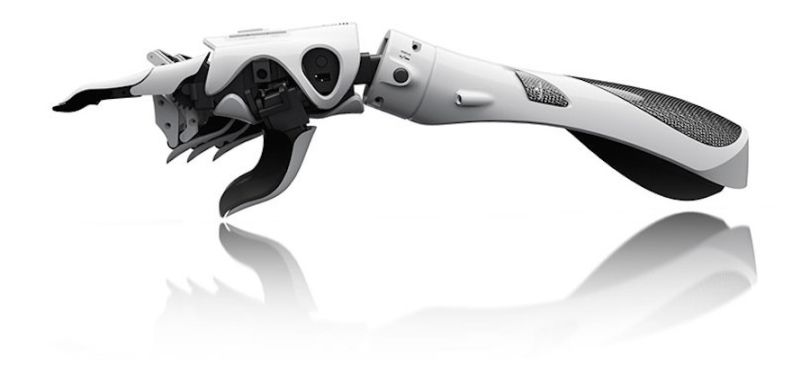

# Projets

## Prosthesis
Main project SynapsÉTS, it consists in the development and design of a robotic arm, with the aim of creating a prosthesis in the future of the club. For example, team members should develop and research drive systems of different articulations, design the structure and outer walls of the arm using CAD software, define the component control system and integrate a Brain Interface. Machine to the system. Since this is a project with a wide variety of tasks, several areas of engineering are applied during design and development.

## MICSA
### (Machine Interface for Cognitive Signal Analysis)
This project is part of our participation in NeurotechX Student Clubs Competition 2017. It involves the development and assembly of an electrical circuit that will interface the body's bioelectric signals with a machine receiving electrical control signals. This project has three components: acquisition, which is the obtaining of nerve signals, processing, which is the filtration of electrical noise and the isolation of useful signals, and the interface, which makes it possible to visualize the data and to save them on a computer. Thus, the project includes tasks in the field of electronics, software and signal processing.

## Unity Project
This project involves the development of a video game in virtual reality that will use a brain-machine interface for greater immersion in the game. Thus, the HTC Vive has been selected as a virtual reality headset and Unity will be used as a driver for our game, with the aim of developing an open source product. Throughout the project, software goals, game tips, will be developed to master the intricacies of the different technologies used. This project is done in collaboration with members of the Conjure Science Club, which supports us in the hardware and development platforms, and participate in the design.

