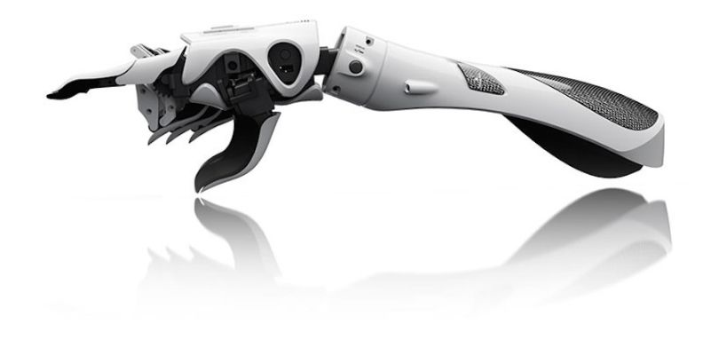

# Projets

## Prothèse
Un des projets de SynapsÉTS, il consiste au développement et à la conception d’un bras robotisée, dans le but de créer une prothèse dans le futur du club. Ainsi, les membres de l’équipe doivent développer et rechercher des systèmes de motorisation de différentes articulations, concevoir la structure et les parois extérieures du bras à l’aide de logiciel CAO, définir le système de contrôle des composantes et intégrer une Interface Cerveau-Machine au système. Puisqu’il s’agit d’un projet aux tâches très varié, plusieurs domaines de génie sont appliqués durant la conception et le développement. 

## MICSA
### (Machine Interface for Cognitive Signal Analysis)
Ce projet est un projet à amélioration continue dans le but de fournir au club des outils technologiques abordables et que nous avons débuté dans le cadre de la compétition de NeurotechX en 2017. Il consiste au développement et au montage d’un circuit électrique qui fera l’interface entre les signaux bioélectrique du corps et une machine recevant des signaux de contrôle électrique. Ce projet comporte 3 volets : l’acquisition, qui est l’obtention des signaux nerveux, le traitement, qui est la filtration des bruits électriques et l’isolation des signaux utiles, et l’interface, qui permet de visualiser les données et de les sauvegarder sur un ordinateur. Ainsi, le projet comprend des tâches touchant le domaine de l’électronique, du logiciel et du traitement de signaux. 

## Projet Unity
Ce projet consiste au développement d’un jeu vidéo en réalité virtuel et qui utiliseras une interface cerveau-machine pour une plus grande immersion dans le jeu. Ainsi, le HTC Vive a été sélectionné comme casque à réalité virtuelle et Unity sera utilisé comme moteur pour notre jeu, dans le but de développer un produit Open Source. Tout au long du projet, des buts de logiciel, des bouts de jeu, seront développé afin de maitriser les subtilités des différentes technologies utilisées.  

## Projet EXO
Le projet EXO est un projet de conception d’exosquelette servant à assister les personnes atteintes de mobilité réduite. Le club compte participer à la compétition d’exosquelette de l’Université du Michigan en 2023. La locomotion chez les patients ayant complètement ou partiellement perdu l’habilité de leur membres inférieures permettra d’éviter le phénomène d’atrophie musculosquelettique. La vision du projet EXO est de pouvoir fournir une technologie permettant des meilleurs résultats en combinant le monde de l’ingénierie et celui de la thérapie médicale. Le club souhaite éventuellement intégrer les outils du projet MICSA avec l’exosquelette du projet EXO pour augmenter la facilité d’utilisation.  

## Présentation
Une présentation des différents projets de SynapsÉTS

